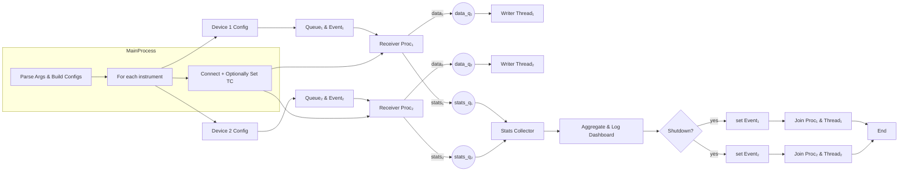

# SR860 Lock-in Amplifier Streaming System

## Quick Start

After configuring your SR860 lock-in amplifier, use this script to stream data:

```bash
python sr860_configured_stream.py --ip 192.168.1.156 --duration 30
```

This will stream data for 30 seconds using your SR860's current configuration and save it to a binary file.

## Overview

This system provides high-performance streaming capabilities for the Stanford Research Systems SR860 lock-in amplifier. The `sr860_configured_stream.py` script is designed to be the primary tool for data collection after you've configured your lock-in amplifier settings.

## Main Script: `sr860_configured_stream.py`

### What It Does

The `sr860_configured_stream.py` script connects to an SR860 lock-in amplifier and streams data at the instrument's configured rate. It:

- **Respects SR860 Settings**: Uses the instrument's current configuration without forcing changes
- **Real-time Monitoring**: Provides live statistics during streaming
- **Binary Output**: Saves data efficiently in binary format
- **Performance Analysis**: Detects packet loss vs. rate inconsistency
- **Organized Output**: Saves files to a `data/` folder
- **Enhanced Rate Tracking**: Monitors actual sample rates from packet headers
- **Header Analysis**: Detects byte order and integrity settings from packets

### Key Features

- **Process-Based Architecture**: Uses multiprocessing for reliable data collection
- **Enhanced Statistics**: Tracks detailed loss events, timing, and rate variations
- **Automatic Byte Order Detection**: Detects and uses correct byte order from packet headers
- **Comprehensive Performance Diagnosis**: Distinguishes between packet loss and SR860 rate variations
- **File Header Metadata**: Saves actual rates and detected settings for accurate analysis

## Basic Usage

### Simple Streaming (Recommended)
```bash
python sr860_configured_stream.py --ip 192.168.1.156 --duration 30
```
Streams for 30 seconds using your SR860's current configuration.

### Set Time Constant Before Streaming
```bash
python sr860_configured_stream.py --ip 192.168.1.156 --duration 60 --time-constant 9
```
Sets time constant to 1ms (index 9) before streaming for 60 seconds.

### Override Specific Settings
```bash
python sr860_configured_stream.py --ip 192.168.1.156 --duration 10 \
    --channel X --format int16 --time-constant 0
```
Maximum speed streaming with X channel only, int16 format, and fastest time constant.

## Command Line Options

### Connection Options
- `--ip IP_ADDRESS` (default: 192.168.1.156)
  - SR860 IP address on the network

- `--duration SECONDS` (default: 10.0)
  - Streaming duration in seconds
  - Use 0 for indefinite streaming (Ctrl+C to stop)

### Configuration Override Options
By default, the script uses the SR860's current configuration. These options allow you to override specific settings:

- `--channel {X,XY,RT,XYRT}` (default: use current)
  - **X**: X component only (1 value/sample)
  - **XY**: X and Y components (2 values/sample)
  - **RT**: R (magnitude) and Theta (phase) (2 values/sample)
  - **XYRT**: All four components (4 values/sample)

- `--format {float32,int16}` (default: use current)
  - **float32**: 4 bytes per value, full precision
  - **int16**: 2 bytes per value, ±32767 range

- `--packet {1024,512,256,128}` (default: use current)
  - UDP packet size in bytes
  - Larger packets = fewer packets/second but more overhead

- `--port PORT` (default: use current)
  - UDP port for streaming data

- `--rate-divider N` (default: use current)
  - Rate divider where actual_rate = max_rate/2^N
  - N=0: maximum rate, N=1: half rate, N=2: quarter rate, etc.

- `--endian {big,little}` (default: use current)
  - Byte order for data transmission

- `--no-integrity` (default: use current)
  - Disable integrity checking (faster but less reliable)

### Time Constant Control
- `--time-constant INDEX` (0-21)
  - Sets the SR860's time constant before streaming
  - **Lower values = faster response = higher max rate**
  - **0**: 1μs (max 1.25MHz)
  - **9**: 1ms (max 78kHz)
  - **21**: 300s (max 1.22Hz)

### Mode Selection
- `--use-current`
  - Force use of current SR860 configuration (ignore other options)

## Architecture: Process-Based Design
```mermaid 
flowchart TD
    A[Start] --> B[Parse Command-Line Arguments]
    B --> C{Connect to SR860?}
    C -- Yes --> D[Optionally Set Time Constant]
    C -- No --> Z[Abort]
    D --> E{Use Current Config?}
    E -- Yes --> F[Read Current Configuration]
    E -- No --> G[Apply New Configuration]
    F --> H[Prepare Filename & Queues]
    G --> H
    H --> I[Spawn Receiver Process]
    I --> J[Start Writer Thread]
    J --> K[Start Streaming on SR860]
    K --> L[Monitor Stats Loop]
    L --> M{Duration Reached or SIGINT?}
    M -- No --> L
    M -- Yes --> N[Signal stop_event]
    N --> O[Stop Streaming on SR860]
    O --> P[Join Receiver & Writer]
    P --> Q[Collect Final Stats]
    Q --> R[Log Final Report]
    R --> S[End]


````
The script uses **multiprocessing** for reliable data collection:
```mermaid 
flowchart LR
    subgraph MainProcess
        A[SR860ConfiguredController]
        B[receiver_process<br/> ProcessStreamReceiver ]
        C[writer_thread<br/> ProcessBinaryFileWriter ]
    end

    %% Communication channels
    B -->|put packet_data| D((data_queue))
    D -->|get packet_data| C

    B -->|put stats_summary| E((stats_queue))
    E -->|get stats_summary| A

    %% Shutdown event
    A -->|signal SIGINT → set| F[[stop_event]]
    B -.->|checks| F
    C -.->|checks| F
```

```
Main Process
├── SR860 Controller (VISA communication)
├── Receiver Process (UDP packet processing)
│   ├── Stats Queue → Main Process
│   └── Data Queue → Writer Thread
└── File Writer Thread (buffered binary output)
```

**Benefits:**
- **Better Isolation**: Each equipment gets its own process
- **Scalability**: Easy to extend to multiple pieces of equipment
- **Fault Tolerance**: Process crashes don't affect other equipment
- **Resource Management**: Better CPU utilization on multi-core systems

## Data Collection Process

### 1. Connection Phase
- Establishes VISA connection to SR860
- Reads current configuration
- Optionally sets time constant
- Optionally applies new configuration

### 2. Streaming Setup
- Creates binary file in `data/` folder
- Starts UDP receiver process
- Configures SR860 to begin streaming

### 3. Data Collection
- **Main Thread**: Monitors progress and displays statistics
- **Receiver Process**: Continuously receives UDP packets
- **File Writer**: Buffers and writes data to disk

### 4. Packet Processing
Each UDP packet contains:
- 4-byte header (counter, rate code, status bits)
- Raw data (X, Y, R, Theta values)
- Only raw data is saved to file (headers are stripped)

### 5. Real-time Analysis
- Packet sequence monitoring (detects lost packets)
- Rate consistency analysis (SR860 may adjust rate)
- Performance metrics calculation
- Header bit analysis (byte order, integrity checking)

## Output Files

### Binary File Format
Files are saved as `data/sr860_configured_IP_TIMESTAMP.bin`

**File Structure:**
```
[4 bytes] Header size (little-endian uint32)
[Header]  JSON metadata (UTF-8 string)
[Data]    Raw binary data (no packet headers)
```

**Enhanced Header Metadata:**
```json
{
  "version": 1,
  "timestamp": 1234567890.123,
  "channel": 3,
  "format": 1,
  "points_per_sample": 4,
  "bytes_per_point": 2,
  "actual_rate_hz": 78125.0,
  "rate_divider": 4,
  "max_rate_hz": 1250000.0,
  "detected_little_endian": true,
  "detected_integrity_check": false
}
```

### Performance Statistics
The script provides comprehensive statistics including:
- Sample rate efficiency
- Packet loss detection
- Data rate (Mbps)
- SR860 rate variation analysis
- Header bit analysis (byte order, integrity checking)
- Performance diagnosis and recommendations

## Performance Characteristics

### Typical Performance
- **No Packet Loss**: 0 sequence errors
- **Efficiency**: 80-95% (SR860 may adjust rate)
- **Data Rate**: 1-160 Mbps depending on configuration
- **Latency**: <1ms typical packet intervals

### Rate vs. Time Constant
| Time Constant | Max Rate | Typical Use |
|---------------|----------|-------------|
| 1μs (0)       | 1.25MHz  | High-speed transients |
| 1ms (9)       | 78kHz    | Standard measurements |
| 300s (21)     | 1.22Hz   | Very slow processes |

## Data Analysis

After streaming, use `sr860_binary_reader.py` for comprehensive analysis:

### Basic Analysis
```bash
python sr860_binary_reader.py data/sr860_configured_192_168_1_156_20250624_163541.bin
```

### Save All Plots
```bash
python sr860_binary_reader.py data/sr860_configured_192_168_1_156_20250624_163541.bin --save-plots
```

### Export to CSV
```bash
python sr860_binary_reader.py data/sr860_configured_192_168_1_156_20250624_163541.bin --export-csv my_data.csv
```

### Complex Analysis (X-Y Data)
```bash
python sr860_binary_reader.py data/sr860_configured_192_168_1_156_20250624_163541.bin --xy-plot both
```

## Other Scripts

### `sr860_optimal_stream.py` - Advanced Users
Automatically determines the optimal streaming rate based on system capabilities and SR860 constraints.

### `sr860_max_stream.py` - Maximum Performance
Attempts maximum rate streaming with optional throttling to prevent packet loss.

### `sr860_binary_reader.py` - Data Analysis
Comprehensive analysis tool for binary files created by the streaming scripts.

## Troubleshooting

### Common Issues

1. **Connection Failed**
   - Check IP address and network connectivity
   - Ensure SR860 is powered on and connected

2. **No Packets Received**
   - Check firewall settings
   - Verify UDP port is not blocked
   - Ensure SR860 streaming is enabled

3. **High Packet Loss**
   - Reduce streaming rate with `--rate-divider`
   - Check network congestion
   - Use smaller packet sizes

4. **Low Efficiency**
   - Check time constant setting
   - SR860 rate variation is normal
   - Only sequence errors indicate real problems

### Performance Optimization

1. **For Maximum Speed**
   - Use single channel (`--channel X`)
   - Use int16 format (`--format int16`)
   - Set fast time constant (`--time-constant 0`)

2. **For High Precision**
   - Use all channels (`--channel XYRT`)
   - Use float32 format (`--format float32`)
   - Set appropriate time constant

3. **For Stable Measurements**
   - Use slower time constants
   - Monitor efficiency vs. packet loss
   - Adjust rate divider if needed

## File Organization

The system creates organized folder structure:
```
TowardWorking/
├── data/                    # Streaming output files
│   ├── sr860_configured_*.bin
│   ├── sr860_optimal_*.bin
│   └── sr860_stream_*.bin
├── reader_output/           # Analysis outputs
│   ├── *_time_series.png
│   ├── *_spectrum.png
│   ├── *_sampling_analysis.png
│   ├── *_xy_plots.png
│   ├── *_complex_analysis.png
│   └── *.csv
└── scripts/
    ├── sr860_configured_stream.py  # Main streaming script
    ├── sr860_optimal_stream.py
    ├── sr860_max_stream.py
    └── sr860_binary_reader.py
```

## System Requirements

- Python 3.7+
- PyVISA for instrument communication
- NumPy for data processing
- Matplotlib for plotting (optional)
- Network connection to SR860
- Sufficient disk space for data files

## Dependencies

```bash
pip install pyvisa numpy matplotlib
```
## Process per instrument (next iteration) 

## Support

For issues or questions:
1. Check the troubleshooting section above
2. Review the performance statistics output
3. Verify SR860 manual for instrument-specific settings
4. Check network connectivity and firewall settings 

## Future Deliverables

### Nanosecond-Accurate Packet Timestamping

Below is the shortest path to **nanosecond-accurate, per-packet timestamps** on Linux together with the pitfalls that usually cause "hiccups" when you try to do it in Python.

---

## 1 · Ask the kernel for the timestamp **once, during `recvmsg()`**

```python
import socket, struct, gc, array

UDP_IP   = "0.0.0.0"
UDP_PORT = 5555
PKT_SIZE = 2048                      # big enough for your largest datagram
CMSG_SZ  = socket.CMSG_SPACE(16)     # space for one struct timespec

sock = socket.socket(socket.AF_INET, socket.SOCK_DGRAM, socket.IPPROTO_UDP)

# 1) Big ring-buffer in the kernel so you never back-pressure the NIC
sock.setsockopt(socket.SOL_SOCKET, socket.SO_RCVBUF, 4 * 1024 * 1024)

# 2) One-line nanosecond software timestamping (supported on every kernel)
sock.setsockopt(socket.SOL_SOCKET, socket.SO_TIMESTAMPNS, 1)
# If the NIC/driver supports PTP you can switch to the richer API:
#   flags = (socket.SOF_TIMESTAMPING_RX_HARDWARE |
#            socket.SOF_TIMESTAMPING_RAW_HARDWARE |
#            socket.SOF_TIMESTAMPING_SOFTWARE)
#   sock.setsockopt(socket.SOL_SOCKET, socket.SO_TIMESTAMPING, flags)

sock.bind((UDP_IP, UDP_PORT))

# Pre-allocate buffers to avoid per-packet mallocs
data_buf  = bytearray(PKT_SIZE)
anc_buf   = bytearray(CMSG_SZ)
iov       = [memoryview(data_buf)]

gc.disable()                         # optional: prevents GC pauses

while True:
    nbytes, ancdata, flags, addr = sock.recvmsg_into(iov, CMSG_SZ)
    for level, ctype, cdata in ancdata:
        if level == socket.SOL_SOCKET and ctype == socket.SCM_TIMESTAMPNS:
            tv_sec, tv_nsec = struct.unpack("qq", cdata)
            ts_ns = tv_sec * 1_000_000_000 + tv_nsec
            # (data_buf[:nbytes] now holds the packet bytes)
            process(ts_ns, data_buf[:nbytes])
```

*What you get*: a **kernel-generated timestamp in the same time base as `clock_gettime(CLOCK_REALTIME)`**, accurate to the nanosecond field of `struct timespec` (≈50 ns RMS on commodity PCs). The control-message path is documented in the kernel's timestamping guide ([docs.kernel.org][1]) and the option itself is `SO_TIMESTAMPNS` ([man7.org][2]).

---

## 2 · Can your Realtek do hardware stamps?

Run

```bash
$ ethtool -T eth0
```

A Realtek RTL8111/8168 (rev 15) normally lists **only software modes**, so the code above is already the best you can do. Hardware timestamping appears only on newer RTL8125 parts and even there it's disabled in the in-tree r8169 driver unless you use a vendor fork ([serverfault.com][3]).

If you truly need sub-microsecond accuracy you'll want an Intel I210/I225 or an AMD‐based Mellanox/Marvell card that advertises `SOF_TIMESTAMPING_RX_HARDWARE`.

---

## 3 · Why pauses still happen & how to shave them off

| Layer              | Typical cause                                                | Mitigation                                                                     |
| ------------------ | ------------------------------------------------------------ | ------------------------------------------------------------------------------ |
| **NIC ↔ kernel**   | Ring overflow bursts (drops rise in `/proc/net/dev`)         | `ethtool -C` to tune interrupt coalescing; enlarge receive ring (`ethtool -G`) |
| **Kernel buffer**  | Auto-tuning grows SO\_RCVBUF too late, causing back-pressure | Pre-set a large buffer (`SO_RCVBUF` + `/proc/sys/net/core/rmem_max`)           |
| **Syscall path**   | One syscall per packet                                       | Batch: use `recvmmsg()` (Python 3.11+) or AF\_PACKET/TPACKET\_V3 mmap rings    |
| **Python runtime** | Allocations + garbage collection every few MB                | Re-use `bytearray`s, disable or retune `gc`, move parsing to Cython/NumPy      |
| **Downstream I/O** | Frequent tiny writes (fsync) to disk                         | Queue in RAM, spill to disk in 1–4 MB blocks or use an async writer thread     |
| **CPU scheduler**  | Other threads pre-empt the reader                            | `chrt -f 90 python …`, pin reader to an isolated core (`isolcpus=` kernel arg) |

At 80 Mb/s you're seeing \~6–7 k UDP datagrams / s (assuming 1500-byte MTU). Even pure-Python can keep up provided you:

1. **Receive → timestamp → enqueue** in one tight loop (no I/O).
2. Hand data to a **separate process/thread** that does disk writes, plots, etc.
3. Keep the NIC & kernel happy with generous buffers so nothing drops while Python is busy.

Do those three and you'll get a steady nanosecond time-stamp for every packet with no periodic stalls.

[1]: https://docs.kernel.org/networking/timestamping.html?utm_source=chatgpt.com "Timestamping - The Linux Kernel documentation"
[2]: https://man7.org/linux/man-pages/man7/socket.7.html?utm_source=chatgpt.com "socket(7) - Linux manual page - man7.org"
[3]: https://serverfault.com/questions/1078760/ptp-support-for-rtl8125b-cg-nic-in-ubuntu-20-04?utm_source=chatgpt.com "PTP support for RTL8125B-CG NIC in Ubuntu 20.04 - Server Fault" 