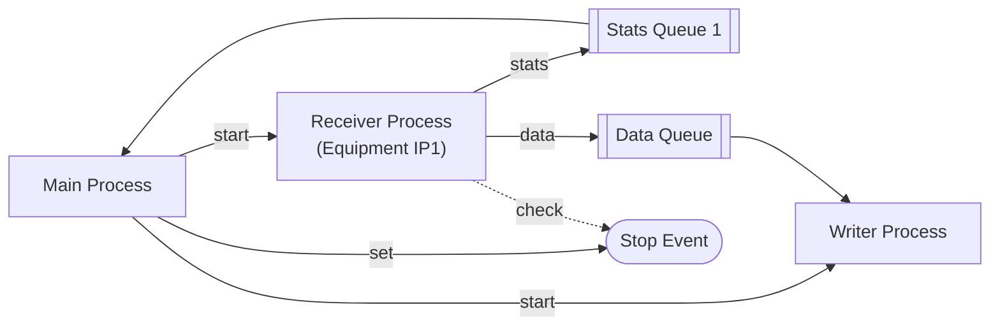

# SR860 Lock-in Amplifier Streaming System

## Overview

This system provides high-performance streaming capabilities for the Stanford Research Systems SR860 lock-in amplifier. It includes multiple streaming scripts optimized for different use cases, with comprehensive data analysis tools.

## Scripts Overview

### 1. `sr860_configured_stream.py` - Recommended for Most Users
Streams data at the SR860's current configuration without forcing optimization. Respects the instrument's settings and provides detailed performance analysis.

### 2. `sr860_optimal_stream.py` - Advanced Users
Automatically determines the optimal streaming rate based on system capabilities and SR860 constraints.

### 3. `sr860_max_stream.py` - Maximum Performance
Attempts maximum rate streaming with optional throttling to prevent packet loss.

### 4. `sr860_binary_reader.py` - Data Analysis
Comprehensive analysis tool for binary files created by the streaming scripts.

## sr860_configured_stream.py - Detailed Guide

### What It Does

The `sr860_configured_stream.py` script connects to an SR860 lock-in amplifier and streams data at the instrument's configured rate. It:

- **Respects SR860 Settings**: Uses the instrument's current configuration without forcing changes
- **Real-time Monitoring**: Provides live statistics during streaming
- **Binary Output**: Saves data efficiently in binary format
- **Performance Analysis**: Detects packet loss vs. rate inconsistency
- **Organized Output**: Saves files to a `data/` folder

### Architecture: Process-Based Design


The script uses **multiprocessing** (not threading) for the receiver to provide:

1. **Better Isolation**: Each equipment gets its own process for data collection
2. **Scalability**: Easy to extend to multiple pieces of equipment
3. **Fault Tolerance**: Process crashes don't affect other equipment
4. **Resource Management**: Better CPU utilization on multi-core systems

**Process Architecture:**
```
Main Process
├── SR860 Controller (VISA communication)
├── Receiver Process (UDP packet processing)
│   ├── Stats Queue → Main Process
│   └── Data Queue → Writer Thread
└── File Writer Thread (buffered binary output)
```

**Inter-Process Communication:**
- **Stats Queue**: Receiver process sends statistics updates to main process
- **Data Queue**: Receiver process sends raw data packets to writer thread
- **Stop Event**: Main process signals receiver to shutdown

This architecture allows each SR860 (or other equipment) to have its own dedicated receiver process, making it easy to scale to multiple instruments.

### Command Line Options

#### Basic Usage
```bash
python sr860_configured_stream.py --ip 192.168.1.156 --duration 10
```

#### Connection Options
- `--ip IP_ADDRESS` (default: 192.168.1.156)
  - SR860 IP address on the network

- `--duration SECONDS` (default: 10.0)
  - Streaming duration in seconds
  - Use 0 for indefinite streaming (Ctrl+C to stop)

#### Configuration Override Options
By default, the script uses the SR860's current configuration. These options allow you to override specific settings:

- `--channel {X,XY,RT,XYRT}` (default: use current)
  - **X**: X component only (1 value/sample)
  - **XY**: X and Y components (2 values/sample)
  - **RT**: R (magnitude) and Theta (phase) (2 values/sample)
  - **XYRT**: All four components (4 values/sample)

- `--format {float32,int16}` (default: use current)
  - **float32**: 4 bytes per value, full precision
  - **int16**: 2 bytes per value, ±32767 range

- `--packet {1024,512,256,128}` (default: use current)
  - UDP packet size in bytes
  - Larger packets = fewer packets/second but more overhead

- `--port PORT` (default: use current)
  - UDP port for streaming data

- `--rate-divider N` (default: use current)
  - Rate divider where actual_rate = max_rate/2^N
  - N=0: maximum rate, N=1: half rate, N=2: quarter rate, etc.

- `--endian {big,little}` (default: use current)
  - Byte order for data transmission

- `--no-integrity` (default: use current)
  - Disable integrity checking (faster but less reliable)

#### Time Constant Control
- `--time-constant INDEX` (0-21)
  - Sets the SR860's time constant before streaming
  - **Lower values = faster response = higher max rate**
  - **0**: 1μs (max 1.25MHz)
  - **9**: 1ms (max 78kHz)
  - **21**: 300s (max 1.22Hz)

#### Mode Selection
- `--use-current`
  - Force use of current SR860 configuration (ignore other options)

### Usage Examples

#### 1. Basic Streaming (Current Configuration)
```bash
python sr860_configured_stream.py --ip 192.168.1.156 --duration 30
```
Streams for 30 seconds using whatever the SR860 is currently configured for.

#### 2. High-Speed Single Channel
```bash
python sr860_configured_stream.py --ip 192.168.1.156 --duration 10 \
    --channel X --format int16 --time-constant 0
```
Maximum speed streaming with X channel only, int16 format, and fastest time constant.

#### 3. High-Precision Multi-Channel
```bash
python sr860_configured_stream.py --ip 192.168.1.156 --duration 60 \
    --channel XYRT --format float32 --time-constant 9
```
All channels with full precision, 1ms time constant for stable measurements.

#### 4. Custom Rate
```bash
python sr860_configured_stream.py --ip 192.168.1.156 --duration 20 \
    --rate-divider 3
```
Streams at 1/8th of the maximum rate (useful for slower signals).

#### 5. Indefinite Streaming
```bash
python sr860_configured_stream.py --ip 192.168.1.156 --duration 0
```
Streams until you press Ctrl+C.

### Data Collection Process

#### 1. Connection Phase
- Establishes VISA connection to SR860
- Reads current configuration
- Optionally sets time constant
- Optionally applies new configuration

#### 2. Streaming Setup
- Creates binary file in `data/` folder
- Starts UDP receiver thread
- Configures SR860 to begin streaming

#### 3. Data Collection
- **Main Thread**: Monitors progress and displays statistics
- **Receiver Thread**: Continuously receives UDP packets
- **File Writer**: Buffers and writes data to disk

#### 4. Packet Processing
Each UDP packet contains:
- 4-byte header (counter, content type, length, rate code, status)
- Raw data (X, Y, R, Theta values)
- Only raw data is saved to file (headers are stripped)

#### 5. Real-time Analysis
- Packet sequence monitoring (detects lost packets)
- Rate consistency analysis (SR860 may adjust rate)
- Performance metrics calculation

### Output Files

#### Binary File Format
Files are saved as `data/sr860_configured_IP_TIMESTAMP.bin`

**File Structure:**
```
[4 bytes] Header size (little-endian uint32)
[Header]  JSON metadata (UTF-8 string)
[Data]    Raw binary data (no packet headers)
```

**Header Metadata:**
```json
{
  "version": 1,
  "timestamp": 1234567890.123,
  "channel": 3,
  "format": 1,
  "points_per_sample": 4,
  "bytes_per_point": 2
}
```

#### Performance Statistics
The script provides comprehensive statistics including:
- Sample rate efficiency
- Packet loss detection
- Data rate (Mbps)
- Timing analysis (latency, jitter)
- SR860 rate variation analysis

### Performance Characteristics

#### Typical Performance
- **No Packet Loss**: 0 sequence errors
- **Efficiency**: 80-95% (SR860 may adjust rate)
- **Data Rate**: 1-160 Mbps depending on configuration
- **Latency**: <1ms typical packet intervals

#### Rate vs. Time Constant
| Time Constant | Max Rate | Typical Use |
|---------------|----------|-------------|
| 1μs (0)       | 1.25MHz  | High-speed transients |
| 1ms (9)       | 78kHz    | Standard measurements |
| 300s (21)     | 1.22Hz   | Very slow processes |

### Troubleshooting

#### Common Issues

1. **Connection Failed**
   - Check IP address and network connectivity
   - Ensure SR860 is powered on and connected

2. **No Packets Received**
   - Check firewall settings
   - Verify UDP port is not blocked
   - Ensure SR860 streaming is enabled

3. **High Packet Loss**
   - Reduce streaming rate with `--rate-divider`
   - Check network congestion
   - Use smaller packet sizes

4. **Low Efficiency**
   - Check time constant setting
   - SR860 rate variation is normal
   - Only sequence errors indicate real problems

#### Performance Optimization

1. **For Maximum Speed**
   - Use single channel (`--channel X`)
   - Use int16 format (`--format int16`)
   - Set fast time constant (`--time-constant 0`)

2. **For High Precision**
   - Use all channels (`--channel XYRT`)
   - Use float32 format (`--format float32`)
   - Set appropriate time constant

3. **For Stable Measurements**
   - Use slower time constants
   - Monitor efficiency vs. packet loss
   - Adjust rate divider if needed

### Integration with Analysis Tools

After streaming, use `sr860_binary_reader.py` for analysis:

```bash
# Basic analysis
python sr860_binary_reader.py data/sr860_configured_192_168_1_156_20250624_163541.bin

# Save plots
python sr860_binary_reader.py data/sr860_configured_192_168_1_156_20250624_163541.bin --save-plots

# Export to CSV
python sr860_binary_reader.py data/sr860_configured_192_168_1_156_20250624_163541.bin --export-csv my_data.csv
```

### File Organization

The system creates organized folder structure:
```
TowardWorking/
├── data/                    # Streaming output files
│   ├── sr860_configured_*.bin
│   ├── sr860_optimal_*.bin
│   └── sr860_stream_*.bin
├── reader_output/           # Analysis outputs
│   ├── *_time_series.png
│   ├── *_spectrum.png
│   ├── *_sampling_analysis.png
│   └── *.csv
└── scripts/
    ├── sr860_configured_stream.py
    ├── sr860_optimal_stream.py
    ├── sr860_max_stream.py
    └── sr860_binary_reader.py
```

### System Requirements

- Python 3.7+
- PyVISA for instrument communication
- NumPy for data processing
- Matplotlib for plotting (optional)
- Network connection to SR860
- Sufficient disk space for data files

### Dependencies

```bash
pip install pyvisa numpy matplotlib
```

### Support

For issues or questions:
1. Check the troubleshooting section above
2. Review the performance statistics output
3. Verify SR860 manual for instrument-specific settings
4. Check network connectivity and firewall settings 